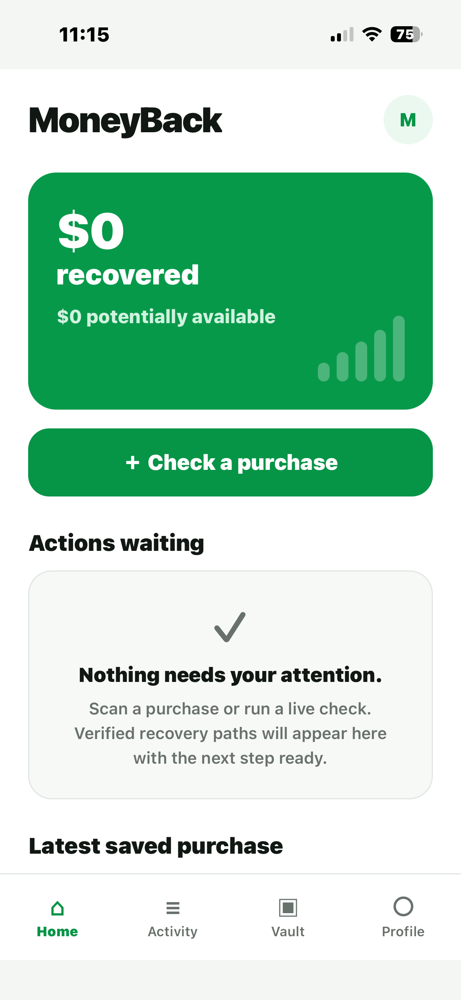
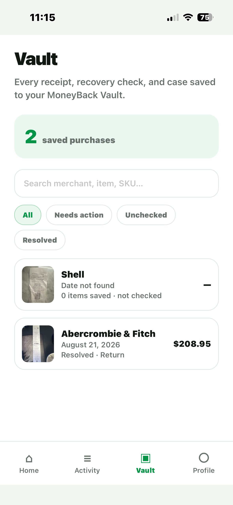
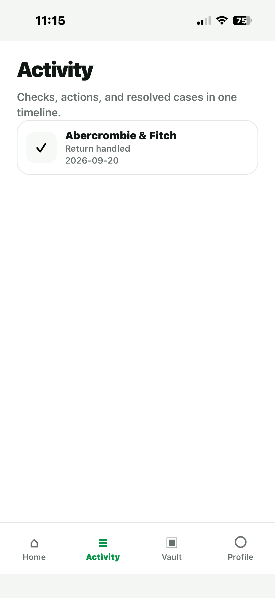

# MoneyBack

MoneyBack is a production iOS application that helps users track purchases, save receipts, monitor return deadlines, and identify opportunities to recover money.

Built with React Native, Expo, and TypeScript, MoneyBack progressed from initial development through TestFlight, App Store review, production release, subscription integration, and post-launch updates.

> The production source code is maintained in a private repository.

## App Preview

<table>
  <tr>
    <td align="center"><strong>Home</strong></td>
    <td align="center"><strong>Vault</strong></td>
    <td align="center"><strong>Activity</strong></td>
  </tr>
  <tr>
    <td></td>
    <td></td>
    <td></td>
  </tr>
</table>

## What MoneyBack Does

MoneyBack gives users one place to manage purchases and return-related activity.

Key workflows include:

- Saving and organizing purchase receipts
- Tracking merchant, purchase, and item information
- Monitoring return deadlines
- Running purchase recovery checks
- Surfacing actions that may require attention
- Recording resolved returns and recovery activity
- Searching and filtering saved purchases
- Syncing user data through a cloud-backed account
- Managing reminder preferences

## Tech Stack

- React Native
- Expo
- TypeScript
- Cloud APIs
- RevenueCat
- EAS Build
- App Store Connect
- Git / GitHub

## Engineering Highlights

- Built production mobile interfaces and workflows using React Native and TypeScript.
- Integrated cloud-backed storage and persistent user data.
- Developed purchase, receipt, recovery, and activity workflows.
- Implemented subscription purchasing and restore-purchase functionality using RevenueCat.
- Added reminder and deadline-management functionality.
- Built loading, empty, error, and authenticated application states.
- Configured production iOS builds using Expo Application Services.
- Worked through TestFlight and App Store review requirements.
- Diagnosed and fixed production packaging, account-flow, and release issues.
- Verified live subscription purchases after App Store release.
- Continued iterating on UI and application behavior after launch.

## Production Release

MoneyBack was taken through the complete iOS release lifecycle:

1. Application development
2. Cloud backend integration
3. Production environment configuration
4. Standalone iOS builds
5. TestFlight testing
6. App Store review
7. Production release
8. Live subscription verification
9. Post-release updates

This project provided experience beyond building a prototype, including real deployment, production debugging, subscription handling, release requirements, and maintaining software after launch.

## Architecture

### Mobile Client

- React Native
- Expo
- TypeScript

### Services

- Cloud-backed application API
- Persistent user data
- RevenueCat subscription management

### Release & Delivery

- Expo Application Services
- TestFlight
- App Store Connect
- Production iOS distribution

## What I Learned

MoneyBack gave me hands-on experience taking a mobile application from development into production.

The project required working through real engineering and release concerns including:

- Environment separation
- API integration
- Authentication and account flows
- Subscription handling
- Production builds
- App Store review
- Release debugging
- Live purchase verification
- Post-release maintenance

## Developer

**Risto Caissie**  
Software Developer — Calgary, Alberta

📧 ristocaissie1@gmail.com
